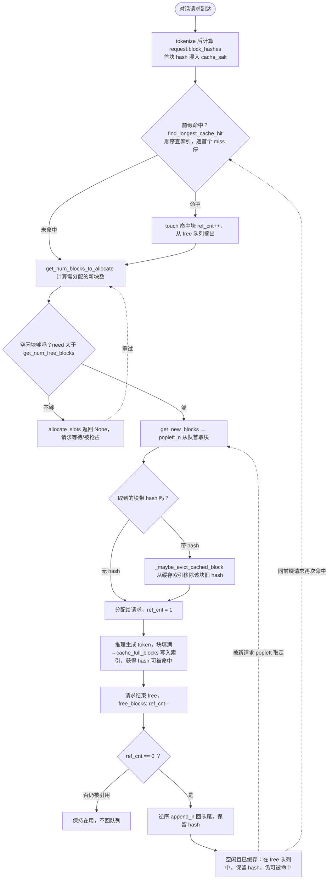
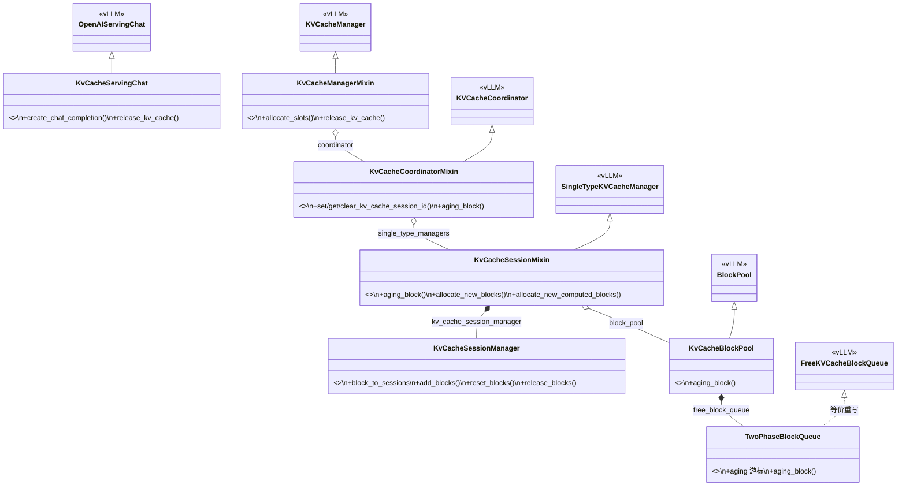

# KV Cache Affinity 插件 · 全流程讲解讲稿

> 讲解目标：让听众理解「原生 vLLM 的 KV 缓存为什么不够用」→「插件加了什么」→「一次释放请求在系统里是怎么跑完的」。
> 建议时长：30–40 分钟。代码位置：插件在项目根 `kv_cache_affinity/`，原生在 `vllm-0.18.0/vllm/`。

---

## 0. 开场一句话定位

> 「这个插件是一个 **vLLM 插件**，用 monkey-patch 在不改 vLLM 源码的前提下，给它加两件事：
> 一是 **KV 缓存的会话亲和性**（同一会话复用同一份前缀缓存），
> 二是 **主动释放**（上下文压缩后，主动把不再需要的旧缓存回收，而不是被动等淘汰）。」

全程围绕一个核心场景：**多轮对话 + 上下文压缩**。这是理解全部设计动机的主线。

---

## 第一部分 · 背景：原生 vLLM 的 KV Cache 与前缀缓存

### 1.1 基础概念

vLLM 把 GPU 显存切成固定大小的 **block**（每块存 `block_size` 个 token 的 KV）。`BlockPool`（`block_pool.py:129`）统一管理，核心三件套：

| 结构 | 作用 |
|------|------|
| `self.blocks: list[KVCacheBlock]` | 所有物理块，`ref_cnt` = 被多少请求引用 |
| `free_block_queue: FreeKVCacheBlockQueue` | 空闲块双向链表，按淘汰顺序排（队首=最先淘汰） |
| `cached_block_hash_to_block` | `block_hash → block` 索引，前缀命中靠它（`block_pool.py:170`） |

**一个 block 的三种状态**（讲的时候画三个圈）：
1. **在用**：`ref_cnt > 0`，不在 free 队列；
2. **空闲且已缓存**：`ref_cnt == 0` 但仍带 `block_hash`，在 free 队列里，**仍可被前缀命中**（前缀缓存的精髓）；
3. **空闲未缓存**：在 free 队列，无 hash。

### 1.2 前缀命中怎么算

block_hash 是**内容寻址的链式哈希**：`本块hash = f(上一块hash, 本块token, extra_keys)`，其中 `extra_keys` 对**首块**混入 `cache_salt`（`block_pool.py:289` 注释）→ **salt 不同则整条链分叉**，这就是 vLLM 做缓存隔离的方式。

命中流程（`kv_cache_manager.py:176` `get_computed_blocks`）：
1. 请求进来算出 `request.block_hashes`；
2. `find_longest_cache_hit` 顺着查索引，**遇第一个 miss 即停**；
3. 命中块 `touch`（`block_pool.py:392`）：`ref_cnt++` 并**从 free 队列摘出**，这部分计算被跳过。

### 1.3 block 生命周期（配流程图 A）



**讲解要点**：
- 淘汰是**隐式副作用**：只在 A7E（取新块时顺手清旧缓存）发生，没有独立淘汰动作。
- 释放（A10）调用链：`scheduler._free_request`（`scheduler.py:1790`）→ `_free_blocks` → `KVCacheManager.free` → coordinator → `SingleTypeKVCacheManager.free`（`single_type_kv_cache_manager.py:276`，这里 `reversed` 逆序）→ `BlockPool.free_blocks`（`block_pool.py:409`，`ref_cnt--` + 归零块 `append_n` 回队尾、**保留 hash**）。

### 1.4 原生机制的四个缺点（用文字讲，不画进图）

1. **缓存匿名、无归属**：只认 `block_hash`，系统不知道块属于哪个会话/租户，无法按会话粒度管理。
2. **只有被动 LRU、无主动释放入口**：没有 API 让客户端说「这段我不要了，现在回收」。只有全清 `reset_prefix_cache` 和给 connector 用的 `evict_blocks`。
3. **压缩后死缓存长期占位**：上下文压缩丢弃的旧块虽已 free，但仍带 hash、仍占 free 队列、且因刚释放排在队尾**最晚被淘汰**；客户端永不再用，却只能被动等 LRU。高并发多会话下浪费容量、降低有效命中率、更易触发抢占。
4. **隔离碎片化无回收手段**：`cache_salt` 让每会话相同内容也各存一份，叠加上面没有主动回收，碎片无法收敛。

---

## 第二部分 · 插件优化方案（5 点，对照缺点）

| # | 优化 | 机制 / 代码 | 解决 |
|---|------|------------|------|
| 1 | **会话级归属追踪** | `KvCacheSessionManager` 维护 `block_to_sessions: {block_id: {session_id}}`，分配时打标签 | 缺点1 |
| 2 | **主动释放入口** | 新增 `POST /release_kv_cache`，打通到 scheduler 的全链路 | 缺点2 |
| 3 | **压缩自动检测触发** | 网关 `affinity_callback` 比对会话快照，system 变/消息数<70% 即判定并发释放 | 缺点3 |
| 4 | **会话引用计数安全回收** | `release_blocks` 仅当 block 的 session 集合变空才回收；`aging_block` 再加 `ref_cnt!=0` 防御 | 缺点4 |
| 5 | **两阶段老化队列** | `TwoPhaseBlockQueue` 加 `aging` 游标，释放块「摘出+重定位」到老化区而非直接驱逐 | 缺点2/3 落地 |

**一句话**：把缓存从「匿名内容块 + 被动 LRU」升级为「带会话归属 + 可主动、安全回收」。

---

## 第三部分 · 架构与代码组织

### 3.1 装配方式：monkey-patch

- `plugin.py` `register()` → `patcher.py` `apply_patches()` 统一注册所有 patch。
- 每个模块一个 `register_xxx()`，把插件方法挂到对应 vLLM 基类上。
- 好处：不改 vLLM 源码；代价：调用流向不直观（讲的时候点一下）。

### 3.2 类图（核心）



---

## 第四部分 · 分配路径：给 block 打会话标签

发生在每次正常请求的 `allocate_slots`（`kv_cache_manager.py:63-84`，插件版）：

1. 分配前 `set_kv_cache_session_id(sharing_salt)`，`try/finally` 包住；
2. 命中块 → `allocate_new_computed_blocks` → `add_blocks(blocks, session)`（`single_type_kv_cache_manager.py:58`）；
3. 新块 → `allocate_new_blocks` → `reset_blocks(blocks, session)`（`:75`）；
4. 写入 `block_to_sessions[block_id].add(session_id)`（`kv_cache_session_manager.py:14`）；
5. 分配后 `finally: clear_kv_cache_session_id()`。

session_id 从哪来：请求 `cache_salt` → 编码进 request_id（`$KV$<salt>:<id>`）→ `Request.from_engine_core_request` 解出 `sharing_cache_salt`（`v1/request.py:16`）。

---

## 第五部分 · 释放路径：全链路详解（本场重点）

### 5.0 网关入口

`affinity_callback.py` 在 LiteLLM 侧缓存每个会话上次的消息快照：
- `async_pre_call_hook`（`:147`）比对：**system prompt 变** 或 **消息数 < 上次的 70%** → 判定压缩（`:190-193`）；
- 命中 → 异步 `_call_release_kv_cache`（`:87`）发：
  ```json
  { "messages": 旧完整消息, "cache_salt": session_id,
    "cache_sharing": true, "messages_released_index": 1 }
  ```
- `messages_released_index=1` = 保留第 0 条（system），其余释放。

### 5.1 核心算法：双渲染 + diff（讲透这一段）

入口 `KvCacheServingChat.release_kv_cache`（`serving_chat.py:208`）。任务：把「保留 N 条消息」翻译成「从哪个 token 开始释放」。

1. `message_begin = messages_released_index`（=1），保留 `messages[:1]`（`:236`）；
2. **before**：渲染整份旧 messages → `before_token_ids`（`:259/296`）；
3. **after**：`model_copy` 出只含 `messages[:message_begin]` 的请求，渲染 → `after_token_ids`（`:272/304`）；
4. 校验 `len(before) > len(after)`（`:312`）；
5. 算 `released_token_index`（`:317-336`，**保留前缀的结束 token 位置**）：
   - 工具变了 → 找第一个 token 分叉点；
   - 否则 → **子序列匹配**：把 after 的 token 在 before 里顺序对齐，定位最后匹配位置；`eos_token_count = 5`（`:327`）用来跳过 chat 模板在 after 末尾多加的收尾 token（如 `<|im_end|>`），避免边界算错；
6. 切片越过 `released_token_index` 的段，`process_inputs` 重建 `EngineCoreRequest` + `encode` 编码，`sub_request_id` 打 `$KV$salt:` 前缀（`:340-391`），组成 `request_params = [(序列化prompt, token偏移)]`；
7. `engine_client.release_kv_cache(cache_salt, request_params)`（`:395`）下发。

> 注意 `:288` 已强制渲染结果恰好 1 段 prompt，所以第 6 步那个 `elapsed_tokens` 多段循环实际只跑一次，是为通用性写的。

### 5.2 跨进程透传 → EngineCore 子进程

```
KvCacheAsyncLLM.release_kv_cache            async_llm.py:8
  → KvCacheMPClient.release_kv_cache        core_client.py:14  (call_utility_async 跨进程RPC)
      → KvCacheEngineCore.release_kv_cache   v1/engine/core.py:39  (在子进程执行)
```

### 5.3 token 下标 → block 区间（`v1/engine/core.py:39`）

```python
for params, release_index in token_requests:
    request = decode_engine_core_request(params)                 # :44 解码
    req = Request.from_engine_core_request(request, hasher)       # 重算 block_hashes + 解 salt
    release_block_index = max(0,
        (release_index * len(req.block_hashes)) // len(req.all_token_ids) - 1)  # :47 比例换算
    released_blocks += self.scheduler.release_kv_cache(
        session_id, req.block_hashes[release_block_index:])      # :51 释放尾部区间
```

**关键**：发送端传 token 偏移，接收端按 `块数/token数` 比例换成 block 偏移，释放 `block_hashes[idx:]` 尾部，`-1` 保守留一块边界。

### 5.4 透传到 manager

```
KvCacheScheduler.release_kv_cache        sched/scheduler.py:6
  → KvCacheManagerMixin.release_kv_cache  kv_cache_manager.py:8
      → KvCacheCoordinatorMixin.aging_block  kv_cache_coordinator.py:65  (遍历 single_type_managers)
```

### 5.5 会话归属安全回收（`single_type_kv_cache_manager.py:91`）

```python
def aging_block(self, session_id, block_hashes):
    aging_blocks = []
    for block_hash in block_hashes:
        cached = self.block_pool.get_cached_block(block_hash, [group_id])
        if cached: aging_blocks.append(cached[0])
        else:      break                                   # 命中链断开就停
    aging_blocks = self.kv_cache_session_manager.release_blocks(aging_blocks, session_id)
    return self.block_pool.aging_block(aging_blocks)
```

`release_blocks`（`kv_cache_session_manager.py:34`）：从每个 block 的 `block_to_sessions[block_id]` 集合里 discard 当前 session，**仅当集合变空**（无其他会话占用）才真正放进待老化列表。→ **多会话共享的 block 不会被某个会话误删**。

### 5.6 实际老化（`two_phase_block_queue.py:236`）

```python
def aging_block(self, block):
    if block.ref_cnt != 0: return 0                        # 运行中请求引用 → 不动
    if block.prev is None and block.next is None: return 0 # 不在 free 队列 → 跳过(防御)
    ...
    # 把块从原位摘出 → 插到 self.aging 游标之后 → 推进 aging
```

效果：被释放的 free block 被摘出原位、聚成连续「老化区」（由 `aging` 游标维护）；被老化块数层层上报，最终成为响应的 `block_released`。

> 老化区对淘汰顺序的精确影响（更早还是更晚被复用）取决于 `aging` 游标位置（初始队尾，被 popleft 消费后重置到队首 `:243`），语义较微妙——若要确定可写单测实测。

### 释放路径流程图（带函数名 + 行号）

```mermaid
flowchart TD
    G0["网关检测压缩 system变/消息数<70%<br/>AffinityCallback.async_pre_call_hook() affinity_callback.py:147"] --> G1["发 POST /release_kv_cache<br/>_call_release_kv_cache() affinity_callback.py:87"]
    G1 --> R1["路由转发取handler，异常包500<br/>release_kv_cache()+chat() api_server.py:29"]
    R1 --> S0["核心算法入口<br/>KvCacheServingChat.release_kv_cache() serving_chat.py:208"]
    S0 --> S1["渲染 before 全量旧messages<br/>render_chat_request() serving_chat.py:259/296"]
    S1 --> S2["渲染 after 保留部分<br/>render_chat_request() serving_chat.py:272/304"]
    S2 --> S3{"校验 len_before 大于 len_after ？ serving_chat.py:312"}
    S3 -- 否 --> SErr["报错返回"]
    S3 -- 是 --> S4{"工具变了吗？"}
    S4 -- 是 --> S4a["找第一个token分叉点 serving_chat.py:318-322"]
    S4 -- 否 --> S4b["子序列匹配 eos_token_count=5 跳尾token<br/>serving_chat.py:323-336"]
    S4a --> S5["得到 released_token_index"]
    S4b --> S5
    S5 --> S6["切片越界段重建并编码，打KV-salt前缀<br/>process_inputs()/encode_engine_core_request() serving_chat.py:340-391"]
    S6 --> S7["下发 self.engine_client.release_kv_cache() serving_chat.py:395"]
    S7 --> E1["KvCacheAsyncLLM.release_kv_cache() async_llm.py:8"]
    E1 --> E2["跨进程RPC KvCacheMPClient.release_kv_cache() core_client.py:14"]
    E2 --> C0["子进程换算 KvCacheEngineCore.release_kv_cache() v1/engine/core.py:39"]
    C0 --> C1["decode_engine_core_request() core.py:44"]
    C1 --> C2["Request.from_engine_core_request() 重算block_hashes v1/request.py:16"]
    C2 --> C3["token偏移→block偏移 release_block_index core.py:47"]
    C3 --> C4["释放尾部 self.scheduler.release_kv_cache() core.py:51"]
    C4 --> D1["KvCacheScheduler.release_kv_cache() sched/scheduler.py:6"]
    D1 --> D2["KvCacheManagerMixin.release_kv_cache() kv_cache_manager.py:8"]
    D2 --> D3["遍历分发 KvCacheCoordinatorMixin.aging_block() kv_cache_coordinator.py:65"]
    D3 --> M1["按hash收集候选块miss即break<br/>KvCacheSessionMixin.aging_block() single_type...py:91-100"]
    M1 --> M2["从block_to_sessions移除本session<br/>KvCacheSessionManager.release_blocks() kv_cache_session_manager.py:34"]
    M2 --> M3{"该block的session集合空了吗？ kv_cache_session_manager.py:48"}
    M3 -- 否别的会话还在用 --> M3N["跳过不回收 防误删共享前缀"]
    M3 -- 是 --> B1["倒序遍历 KvCacheBlockPool.aging_block() block_pool.py:9"]
    B1 --> B2{"ref_cnt等于0且在free队列？ two_phase_block_queue.py:237-240"}
    B2 -- 否 --> B2N["return 0 不动该块"]
    B2 -- 是 --> B3["摘出→插到aging游标后→推进游标 聚成老化区<br/>TwoPhaseBlockQueue.aging_block() two_phase_block_queue.py:236"]
    B3 --> RET["累加层层上报 响应 block_released serving_chat.py:398"]
```



---

## 第六部分 · 一个贯穿的数字示例（讲完流程后用它收尾）

假设旧对话渲染后：`before_token_ids` 共 **1000** token，block_size=16 → `block_hashes ≈ 63`；`messages_released_index=1` 保留 system，`after` 渲染 **200** token：

```
1) 双渲染 diff → released_token_index ≈ 200 (system 结束位置)
2) request_params = [(序列化的1000-token prompt, 200)]
3) 跨进程到 EngineCore
4) release_block_index = max(0, (200*63)//1000 - 1) = max(0, 12-1) = 11
5) 释放 block_hashes[11:] (block 11~62 对话历史)，保留 block_hashes[:11] (system)
6) 逐块判会话归属：只有 session 集合空的才进老化区
7) TwoPhaseBlockQueue 把它们摘出聚到老化区 → 返回 block_released
```

---

## 附录 A · 全链路函数索引

| 层 | 函数 | 文件:行 |
|----|------|---------|
| 网关 | `AffinityCallback.async_pre_call_hook` | `affinity_callback.py:147` |
| 网关 | `AffinityCallback._call_release_kv_cache` | `affinity_callback.py:87` |
| 路由 | `release_kv_cache` (route) + `chat()` | `api_server.py:29` |
| 服务 | `KvCacheServingChat.release_kv_cache` | `serving_chat.py:208` |
| 服务 | `render_chat_request` ×2 | `serving_chat.py:259/272` |
| 服务 | `pack_request_sharing_cache_salt` | 定义 `core.py:14` |
| 服务 | `input_processor.process_inputs` | `serving_chat.py:375` |
| 服务 | `encode_engine_core_request` | 定义 `core.py:28` |
| 引擎 | `KvCacheAsyncLLM.release_kv_cache` | `async_llm.py:8` |
| 引擎 | `KvCacheMPClient.release_kv_cache` | `core_client.py:14` |
| EngineCore | `KvCacheEngineCore.release_kv_cache` | `v1/engine/core.py:39` |
| EngineCore | `decode_engine_core_request` | 定义 `core.py:33` |
| Request | `Request.from_engine_core_request` | `v1/request.py:16` |
| 调度 | `KvCacheScheduler.release_kv_cache` | `sched/scheduler.py:6` |
| 管理 | `KvCacheManagerMixin.release_kv_cache` / `allocate_slots` | `kv_cache_manager.py:8/63` |
| 协调 | `KvCacheCoordinatorMixin.aging_block` | `kv_cache_coordinator.py:65` |
| 单类型 | `KvCacheSessionMixin.aging_block` | `single_type_kv_cache_manager.py:91` |
| 会话 | `KvCacheSessionManager.{add,reset,release}_blocks` | `kv_cache_session_manager.py:14/25/34` |
| 块池 | `KvCacheBlockPool.aging_block` | `block_pool.py:9` |
| 队列 | `TwoPhaseBlockQueue.aging_block` | `two_phase_block_queue.py:236` |

## 附录 B · 预判问答

- **Q：会释放 tool 部分吗？** 不会。网关不传 `tools_released_index` → `tool_changed=False`；tools 渲染在 prompt 最前，落在保留前缀里，不在释放的尾部区间。
- **Q：压缩误判会怎样？** 最坏是多释放了仍可能复用的前缀，下次请求 cache miss 重算，**不影响正确性**，只损失一点命中率。
- **Q：并发安全？** 当前假设 vLLM 单线程调度；session_id 用 try/finally 注入清除，未加锁。
- **Q：session_store 会无限增长吗？** 网关侧有 TTL（7200s）+ 超 100 条触发清理（`affinity_callback.py:136/257`）。
- **Q：跨进程怎么传 session？** 编码进 request_id（`$KV$<salt>:<id>`），子进程 `from_engine_core_request` 解出。
</content>
</invoke>
